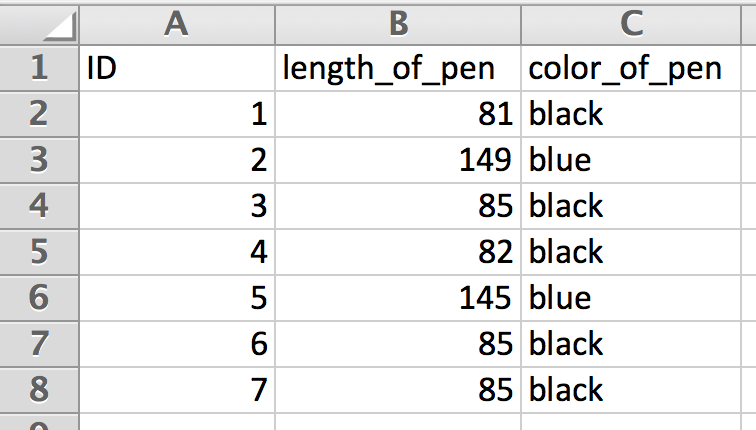

Intro to R for Biologists
========================================================
author: Katinka Fischer & Simon Schliesky
date: 2016-09-20


Sneak Preview
========================================================


Topics
========================================================

1. **What is R?** - How does it work? How does it store these numbers?
2. **From Excel to R** - What are the pitfalls?
3. **Fitness of tables** - How to prepare R-compatible tables?
4. **Best practices** - How to keep frustration levels minimal?
5. **Library** - Collection of helpful sources to seriously start learning R.
6. **Q&A** - Open questions 

Disclaimer
========================================================

We do **not** want you to become R experts from a 2h lecture.

We **do** want to ease collaborations by giving you a basic understanding of what is happening *behind the scenes*.

We will focus on **what** R can do rather than why it can do that.


What is R? (1)
========================================================
R is a programming language, thus you can compute things:

```r
  1+2+3+4
```

```
[1] 10
```

```r
  ((1+1*5)^2+6)/7
```

```
[1] 6
```

```r
  sum(1:10)
```

```
[1] 55
```


What is R? (2)
========================================================
You can store values into variables and use them for calculations:

```r
  number_of_people_in_this_room <- 17

  # You can write comments to explain your code
  # (they are ignored, but help understanding)

  # Check if number is even (divisible by two)
  # 0=Yes 1=No
  number_of_people_in_this_room %% 2
```

```
[1] 1
```


What is R? (3)
========================================================
More than one value can go into a single variable as well:

```r
  speaker_names <- c("Katinka", "Simon")
  # They are stored in a numbered list
  # Access single items with square brackets
  speaker_names[2]
```

```
[1] "Simon"
```

```r
  # R calls these lists of items: vector
  speaker_names
```

```
[1] "Katinka" "Simon"  
```


What is R? (4)
========================================================
Ranges of numbers are designed for easy use:

```r
numbers_from_1_to_10 <- 1:10
numbers_from_1_to_10
```

```
 [1]  1  2  3  4  5  6  7  8  9 10
```

```r
#remember the example from the first slide?
sum(numbers_from_1_to_10)
```

```
[1] 55
```


What is R? (5)
========================================================
Data frames, the most important data structure:

```r
  # a data frame is a table with labeled rows
  # and columns
  speakers <- data.frame(
    row.names=speaker_names,
    species=c("human", "human"),
    hair_color=c("blonde","brown")
    )
  #print data frame
  speakers
```

```
        species hair_color
Katinka   human     blonde
Simon     human      brown
```


What is R? (6)
========================================================
Data frames, the most important data structure:

```r
  # access a column by name
  speakers$hair_color
```

```
[1] blonde brown 
Levels: blonde brown
```

```r
  # or by index [row,col] where empty means all
  # so give me column 1 of all rows
  speakers[,1]
```

```
[1] human human
Levels: human
```


What is R? (7)
========================================================
How to select rows by name?

```r
  # if row name equals
  simon_row <- row.names(speakers) == "Simon"
  # returns a vector of True and False values
  simon_row
```

```
[1] FALSE  TRUE
```

```r
  # This can be used as index list as well
  # with row index simon_row return all columns
  speakers[simon_row,]
```

```
      species hair_color
Simon   human      brown
```

What is R? (8)
========================================================
One word about data types:

```r
  # speaker names are text (characters)
  class(row.names(speakers))
```

```
[1] "character"
```

```r
  # characters are created with double quotes
  class("This is of type character")
```

```
[1] "character"
```

What is R? (9)
========================================================
Categories are better represented by factor:

```r
  # speaker names are text (characters)
  colors <- c("blond", "blond", "brown", "blond", "red")
  as.factor(colors)
```

```
[1] blond blond brown blond red  
Levels: blond brown red
```

What is R? (10)
========================================================
Categories are better represented by factor:

```r
  summary(colors)
```

```
   Length     Class      Mode 
        5 character character 
```

```r
  summary(as.factor(colors))
```

```
blond brown   red 
    3     1     1 
```

What is R? (11)
========================================================
Any questions?

From Excel to R? (1)
========================================================
Excel tables and data frames are similar, however:
- Data frames must not have different column lengths
- Row and column names are not part of the cells
- Spaces in names are not allowed ($-syntax would not work)
- Column names must be unique
- Non-rectangular tables are problematic
- **One row represents one dataset**

How does this apply to reality?


From Excel to R? (2)
========================================================


***

Example Excel sheet with:
- unique headers
- no spaces
- rectangular


From Excel to R? (3)
========================================================
In R this looks like:

```r
  pen_experiment <- read.csv("data/pens.csv")
  pen_experiment
```

```
  ID.length_of_pen.color_of_pen
1                    1;81;black
2                    2;149;blue
3                    3;85;black
4                    4;82;black
5                    5;145;blue
6                    6;85;black
7                    7;85;black
```


From Excel to R? (4)
========================================================
That did not look correct:

```r
  pen_experiment <- read.csv("data/pens.csv",
                             header=TRUE,
                             row.names=1,
                             sep=";")
  pen_experiment
```

```
  length_of_pen color_of_pen
1            81        black
2           149         blue
3            85        black
4            82        black
5           145         blue
6            85        black
7            85        black
```


From Excel to R? (5)
========================================================
Useful next steps:

```r
  summary(pen_experiment)
```

```
 length_of_pen   color_of_pen
 Min.   : 81.0   black:5     
 1st Qu.: 83.5   blue :2     
 Median : 85.0               
 Mean   :101.7               
 3rd Qu.:115.0               
 Max.   :149.0               
```


From Excel to R? (6)
========================================================
Putting comments at the top of your Excel file makes life easier:

***

```r
  read.csv("data/pens2.csv",
        header=TRUE,
        row.names = 1,
        sep=";",
        comment.char = "#")
```


From Excel to R? (7)
========================================================
Any questions?


Fitness of Tables? (1)
========================================================
Unfortunately reality often looks different


Fitness of Tables? (2)
========================================================

```r
  read.csv("data/nightmare.csv",header=TRUE,
                sep=";",dec=",",comment.char = "#")
```

```
   Experiment.231.chlorophyll.and.NADH.concentration.after.treatment.A
1                                                                     
2                                                          chlorophyll
3                                                                 NADH
4                                                                     
5                                                              average
6                                                                stdev
7                                                                     
8  Experiment 233 chlorophyll and NADH concentration after treatment C
9                                                                     
10                                                         chlorophyll
11                                                                NADH
         X     X.1     X.2     X.3 X.4 X.5
1  sample1 sample2 sample3 sample4  NA  NA
2    0,014   0,024    0,01   0,017  NA  NA
3    2,014    1,98   2,001   2,009  NA  NA
4                                   NA  NA
5    2,001                          NA  NA
6    0,013                          NA  NA
7                                   NA  NA
8                                   NA  NA
9  sample1 sample2 sample3 sample4  NA  NA
10  0,0141  0,0329  0,0139  0,0256  NA  NA
11  2,0233  1,9805  2,0083  2,0119  NA  NA
   Experiment.232.chlorophyll.and.NADH.concentration.after.treatment.B
1                                                                     
2                                                          chlorophyll
3                                                                 NADH
4                                                                     
5                                                                     
6  Experiment 234 chlorophyll and NADH concentration after treatment D
7                                                                     
8                                                          chlorophyll
9                                                                 NADH
10                                                                    
11                                                                    
       X.6     X.7     X.8     X.9
1  sample1 sample2 sample3 sample4
2    0,022  0,0287  0,0194  0,0224
3   2,0197  1,9832    2,01  2,0157
4                                 
5                                 
6                                 
7  sample1 sample2 sample3 sample4
8   0,0185  0,0299  0,0172  0,0231
9   2,0161  1,9839  2,0075  2,0171
10                                
11                                
```


Fitness of Tables? (3)
========================================================
Problems with this layout

---
- These are four tables not one
- Tables are placed almost randomly
- row and column identities are inconsistent
- One row = One dataset violated


Fitness of Tables? (4)
========================================================
New Layout:

***

- Now we have one table
- Distinction between four tables is implemented through extra category (column)
- One row = One dataset


Fitness of Tables? (5)
========================================================
This looks better in R:

```r
  better<-read.csv("data/bettersleep.csv",header=TRUE,
                sep=";", dec=",",comment.char = "#")
  better
```

```
   sample.name experiment_id treatment chlorophyll_conc nadh_conc
1      sample1           231         A           0.0140    2.0140
2      sample2           231         A           0.0240    1.9800
3      sample3           231         A           0.0100    2.0010
4      sample4           231         A           0.0170    2.0090
5      sample1           232         B           0.0220    2.0197
6      sample2           232         B           0.0287    1.9832
7      sample3           232         B           0.0194    2.0100
8      sample4           232         B           0.0224    2.0157
9      sample1           233         C           0.0141    2.0233
10     sample2           233         C           0.0329    1.9805
11     sample3           233         C           0.0139    2.0083
12     sample4           233         C           0.0256    2.0119
13     sample1           234         D           0.0185    2.0161
14     sample2           234         D           0.0299    1.9839
15     sample3           234         D           0.0172    2.0075
16     sample4           234         D           0.0231    2.0171
```


Fitness of Tables? (6)
========================================================
Now we can start processing the data:

```r
  table(better$treatment)
```

```

A B C D 
4 4 4 4 
```

```r
  summary(better$nadh_conc)
```

```
   Min. 1st Qu.  Median    Mean 3rd Qu.    Max. 
  1.980   1.997   2.010   2.005   2.016   2.023 
```


Fitness of Tables? (7)
========================================================
Any questions?


Best Practices. (1)
========================================================
The mission:
  - mark important genes

Best Practices (2)
========================================================
DONT


---

DO


---

filtering only by color is undetectable in csv

Best Practices (3)
========================================================
DONT


---

DO


Best Practices (4)
========================================================
BEST


Best Practices (5)
========================================================
It is not always about R:
* opportunity to improve Excel skills as well
  - and save time
* compatibility to many tools instead of just one
* closer to the file formats produced by lab hardware

--
Want to learn more?
* Checkout [Seven deadly spreadsheet sins](http://production-scheduling.com/seven-deadly-spreadsheet-sins/)


Best Practices? (6)
========================================================
Any questions?


Library (1)
========================================================
 Resources for learning:
* [Getting used to R, RStudio, and R Markdown](https://ismayc.github.io/rbasics-book/) (final draft)
  - covers everything that has been explained
  - Additionally explains how to write full reports within Rstudio
* [R for Biologists](https://cran.r-project.org/doc/contrib/Martinez-RforBiologistv1.1.pdf)

Resources for packages:
* [CRAN package index](https://cran.r-project.org/) or [google](https://google.com)
* Specifically for biology: [Bioconductor](https://www.bioconductor.org/)

Library (2)
========================================================
Find this presentation on GitHub:

**https://github.com/sisch/R-intro**


Q&A
========================================================
Time for additional questions and live demos.
